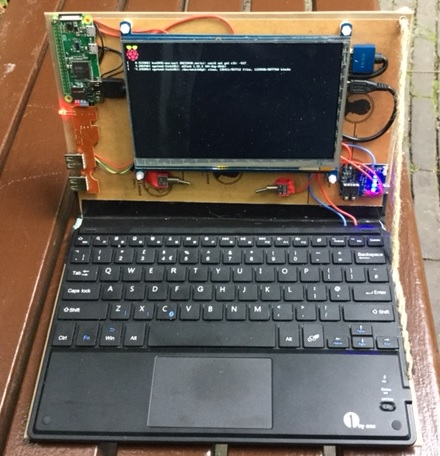
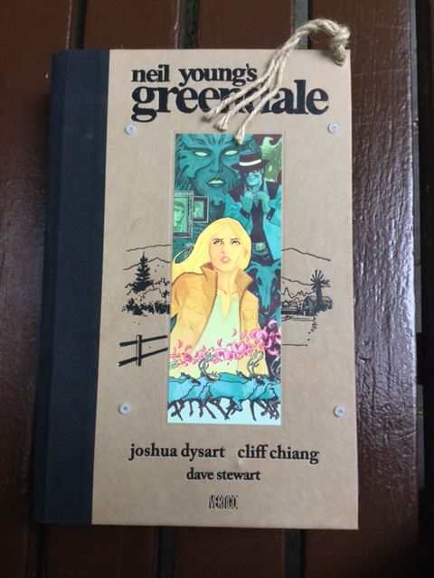
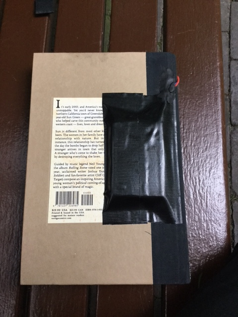
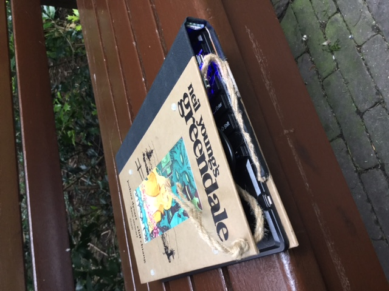
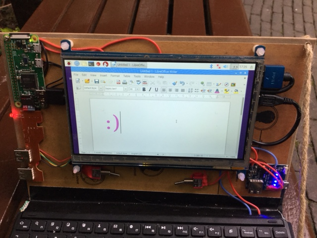

# Zero comic - Raspberry pi laptop

   

> A pi zero based laptop packed inside old comic book covers.

 

### Making of a portable computer

It took about a week of planning, mostly deciding what parts to use and figuring out how to make it work like a laptop, then an afternoon of putting it together. 

The computer is pi zero w, the screen a 7'' waveshare capacitive one, battery a 5000mah powerbank taken apart and I used a bluetooth keyboard with built in touchpad. There is also a usb hub, some wire, two switches and an old comic book with firm hard covers and not too interesting content (or I would find it too hertbreaking to rip it apart).

#### The screen

Waveshare provide quite good instructions on their website, for the screen I used you can find them [here](http://www.waveshare.com/wiki/7inch_HDMI_LCD_(C)). Setup boils down to adding a few lines to config.txt (if you don't know how to do that, have a look [here](https://github.com/unusualcomputers/unusualcomputers/blob/master/writing/text/config_gfiles.md#notes-on-editing-raspberry-configuration-files#config.txt)).

The touch part works simply by connecting a micro usb port to a hub connected to the raspberry. 

For this build I cut the cable and soldered it directly onto a usb hub, in place of a usb port I desoldered. 
Removing usb ports most often requires just a bit of violence - I normally first remove the solder holding the casing in place (big chunky blob of solder), then slowly move the port up till it's vertical. This is scary, often  you see the parts of the port slowly ripping through the circuit board, but so far I've not damaged any hubs this way. After that it's pretty easy, there are four connections, keep warming them up and pulling the port up. Sometimes it falls off and you are left with just four wires, even better, melt the solder and pull them off one by one. 
Once that was out of the way I spent about ten minutes checking, re-checking and testing the pinout of the cable and the port and the holes on board - usb comes with four wires, +5v, ground, D+ and D-, they are colour coded in cables and internet is full of pinout diagrams for ports. Easy, but well worth checking and re-checking, I did ruin components by mixing them up.

#### Usb hub

This was a £2 pound one from ebay, I opened up the casing and threw it away, then soldered it onto pi zero, as described [here](https://github.com/unusualcomputers/unusualcomputers/blob/master/writing/text/usbnotes.md#soldering-the-hub-to-pi-zero). 

#### Power 

I used an anonymous powerbank from ebay, when opened it had a small printed board and a big battery pack. The board is used for charging and converting power to 5V. It was marked as being able to supply 2A of power, plenty for pi zero and the 7 inch screen.

I desoldered the battery pack, attached longer wires to it and glued it on the back cover, protecting it with some black duct tape.

   

The wires went through the spine and were soldered on the power board. This board had ports for direct 5V output and from there I ran wires to pi test points pp1 and pp6 via an old fashioned switch (nice shiny metal and red plastic). The screen is powered through usb (same cable that makes touch work) and I added another switch on the power line there - partly because it looks nice to have two of them, partly because the screen sometimes needs to be restarted to get touch to work (not figured out why this is yet).

That was it as far as electronics goes. 

#### Software

I am running a straightforward raspbian installation. I chose pi zero w because it makes it easy to connect the keyboard - there is plenty of bluetooth ones on amazon and ebay. I chose one with a touchpad built in but I am not sure this is justified, with the touchscreen working as well as it does I rarely use it. Connecting it to raspbian was a matter of clicking on the bluetooth icon, letting it find the keyboard and clicking a few buttons on the keyboard. 

One bit of nuisance here - built in bluetooth and wifi don't work very well together in raspberries (at the time of writing). I had wifi connection dropping randomly till I gave up and plugged an external adapter into the usb hub. Works a charm now, but am hoping raspberry foundation will sort this out sometime soon and hopefully in software, so I can get my port and my dongle back.  

For browsing so far I have been using dillo - impressively fast, though it does not do javascript which makes it unable to deal with fancy stuff like twitter <_<

I am typing this in ReText - lovely editor, also gives me git markup preview. 

Office Libre works well, so does a whole lot of development applications and ... wait for this ... kodi. I installed kody krypton using instructions [here](https://linuxsuperuser.com/install-latest-version-kodi-raspbian-jessie/) and with a usb sound card it works a charm.

### Putting it all together

The cominc book used had really nice firm covers and the picture on the outside was much better the content, so I cut out the pages with a carpenters knife, strengthened the spine with some duck tape and a couple of small right angle brackets on the outside, then screwed on the screen and the pi and glued on everything else using red sugru. 
The screws that came with the screen are soft plastic and quite long so they stick out a few milimeters, it turns out this is perfect to keep the screen above the keyboard and protect it from scratches. 

To keep the screen in place I drilled a hole in the cover and ran a piece of rope through it. One end I glued to the back cover, next to the keyboard, in the other one I tied a knot, this way I can control the angle of the screen till I'm happy with it. 

I have now been typing away, installing things, looking things up on internet for about two and a half hours and the baterry is at about 50%. 
When closed, the laptop easily fits into a small rucksack or a bag, it is about the same thickness as the comic was and quite a bit lighter than it.

   
 

   
 
 
 
