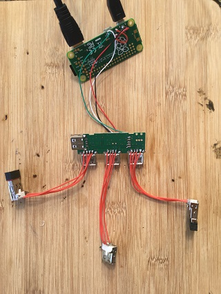
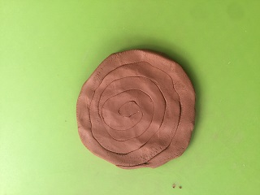
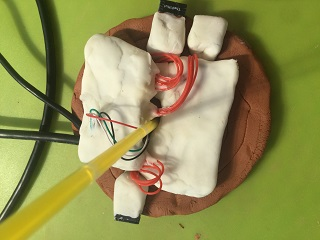
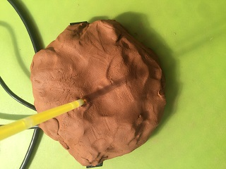
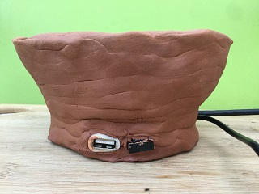
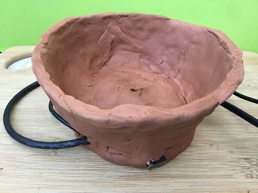
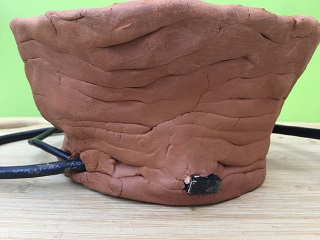

# Kodi in a flower pot

  

> A fully functional kodi machine built into a fully functional flower pot.
> The computer is Raspberry Pi Zero running OpenElec, the pot is made of clay.

### Rough design

There is intrinsic beauty in rough unpolished shapes and there is humanity and deep thought in shaping mud, philosophers know this.

Technologists, on the other hand, know that it is neither hard nor expensive to build small computers and there is immense joy in thinking through the wiring and software and seeing it light up a screen in the end.

Everyone knows that putting together a useful thing of beauty is what we are for, even at times when taking pride in it is considered naïve. Nowadays we are overwhelmed by noisy grey boxes or sleek flat slabs. Nothing necessarily wrong with them, except that there is nothing else. Beauty is far richer than this, functional design is far more varied than this.

So I made a flower pot with the best entertainment centre there is built into it, for about £23 (€25/$30).

### The computer

Any Raspberry Pi would have worked, so would any of the knock offs (Orange Pi, Banana Pi ... ), kodi runs well on them all. Pi Zero is ideal, smallest and the cheapest of the lot. The newer Pi Zero W has Wi-Fi built in, but it would have been wasted here, the machine is under layers of clay, earth and silicone, reception would be rubbish.

#### Software
Setting up software was as easy as it gets, a straightforward OpenElec installation. 

To do this yourself:

> If you have access to a computer with an SD card reader, download the OpenElec disk image from [here](http://openelec.tv/get-openelec)  and follow instructions [here](https://www.raspberrypi.org/documentation/installation/installing-images/) to copy it onto a micro-SD card. If you don't, by far the best option is to ask someone who does, anyone with a soul should do it for a smile. If they don't have an SD card reader you can buy one for a couple of euros, pounds, dollars.

> The choice of SD cards is permanently a topic on enthusiasts forums, in short: anything with 4Gb or more will work. SanDisk ones are probably fastest, Kingston probably slowest. Get what you can afford and don't worry.

> Similarly, OpenElec is not the only option, there are at least two more systems just as popular, LibreElec and OSMC. In both set-up and usage there is no real difference between them, if you can't make your mind up say their names out loud and choose one you like the best, it will help when you are explaining someone what you did.

#### USB hub

For internet, cable is always faster than Wi-Fi; it can only be used when the TV is close enough to the router but it's good to have it as an option. 
Simplest and cheapest is to provide an empty USB port and get hold of a USB-ethernet converter (£2 on e-bay). 

For everything else we need a Wi-Fi connection, a USB Wi-Fi dongle works. 

> The choice of a WiFi dongle is another hot topic in Raspberry Pi community. You can buy them for anything between £2 and £25 and spend a lifetime researching this. If you are buying them in the shop, chances are you can return broken ones, so start low and try them. If buying online, anything that mentions raspberry (and most that don't) on e-bay, aliexpress, amazon etc will do.

We also need some kind of remote control. Kodi works well with remote controls that come with some TV sets, it is always worth checking [here](http://kodi.wiki/view/CEC) if you know where the machine will be used. If the TV set is listed there, you don't need anything else. If not, there are options like smart phone apps to control them or really cheap IR remotes (under £2). I went for a small hand-held keyboard like this: 

Got it of ebay for a fiver,it took a couple of weeks to arrive and it worked. These keyboards come with a dongle that you plug into USB and just work, a mouse pad and all the keys are there. And it's rechargeable. Can't ask for more.

All in all, three USB ports. The hub used was a £2 anonymous e-bay special, so I had to put in some effort make it work but it does (and in honesty, not that much - see [details here](https://github.com/unusualcomputers/unusualcomputers/blob/master/writing/text/usbnotes.md#hack-one-software), a small change to autostart.sh file on the sd card and it was up and running).

At this point I put it all together, connected the hub using a mini usb shim (a small adapter that goes inside a usb plug), a TV using a mini HDMI to HDMI cable and powered it up through a USB port on the TV. All was looking great except that I could not install any add-ons no matter what I tried. The next day I re-installed OpenElec and it just worked. Not sure what went wrong, nor if this was a problem with my installation or kodi servers, but the fix was ten minutes of work, so not really sure I care.

Pi zero is tiny, the hub with a plastic box and even the USB plug looked unjustifiably big, so I took that apart and soldered it onto the pi board (details [here](https://github.com/unusualcomputers/unusualcomputers/blob/master/writing/text/usbnotes.md#hack-one-software)). I had to make a connection between the id and ground pins on the micro usb port at this point to make pi recognize the hub, details [here](https://github.com/unusualcomputers/unusualcomputers/blob/master/writing/text/usbnotes.md#soldering-the-hub-to-pi-zero).

Finally, a flower pot should be round and USB ports should be on its sides, so that dongles stick out for better reception, and the usb hub is rectangular :unamused: I had some loose usb ports from before (can't quite remember, but about a couple of pence each, I ordered them ages ago when buying something else, felt good that I found use for them). If I didn't I would have desoldered the ones already on the hub and used those instead. 

I soldered wires between the loose ports and the existing ports on the hub and had the backbone of the machine ready. Pi and the hub could now be buried in clay and the ports laid near the edge of the pot. 

And it was beautiful.

Tested it all again, and it worked.

#### Insulation

It might not have mattered, but I have no idea how porous or conductive clay is, so had to insulate all this. One option was wrapping it all tightly into a plastic bag, which would likely be fine, but wanted to try [home-made sugru](https://github.com/unusualcomputers/unusualcomputers/blob/master/writing/text/silicone_dough.md#notes-on-silicone-doughoogoohome-made-sugru) for a while, and it worked a charm.

> Note to self: it looks alien and feels weird to touch, need to use silicone dough for something visible soon.

Tested again. It still worked.

#### The pot

I never even touched clay before, preparations involved reading up a bit and watching youtube while at work in the week before. The plan was to build the computer into the base. Pots need holes in the bottom; the computer is made of two boards, a straw should fit in between them and leave a hole when removed. The bottom will have two layers. I was making a sandwich, clay, computer, clay. And I used air-drying clay, can't bake this.

Apparently you make a bottom of the pot by rolling clay out into a long sausage and then making a tight swirly circle, so the first layer:

Then the machine, cables together, usb ports on the edges, straw through the middle:

And a layer on top:

Finally, the walls - again a long sausage of clay layered in a widening spiral, squeezed lightly as I built it up.

And there it was :grinning:

  
  
  

#### Epilogue:

While drying, which takes days, a crack appeared in the base. Not really a problem, the structure is sound, the electronics well insulated and it won't be visible once the flowers are in. Will fill it up with leftover silicone just so that the pot is not too leaky. The layers of the base need to be thinner - my bad for not trusting clay would harden and easily carry the stuff inside. In hindsight, the usb hackery i did was largely because it was fun, I can easily see all of this working with just a hub plugged in and a bit of a plastic wrapper. The pot may need to be square and a bit bigger but nothing wrong with that. More so, for most other containers this would not matter.

