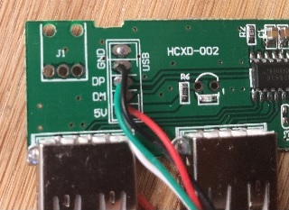
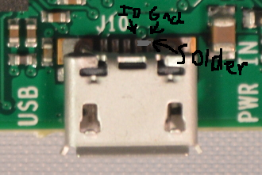

# Notes on connecting USB hubs to pi zero

* [Introduction](https://github.com/unusualcomputers/unusualcomputers/blob/master/writing/text/usbnotes.md#introduction)
* [Power](https://github.com/unusualcomputers/unusualcomputers/blob/master/writing/text/usbnotes.md#power)
* [Choosing a hub](https://github.com/unusualcomputers/unusualcomputers/blob/master/writing/text/usbnotes.md#choosing-a-hub)
* [Hack one, software (hub not recognized)](https://github.com/unusualcomputers/unusualcomputers/blob/master/writing/text/usbnotes.md#hack-one-software)
* [Soldering the hub to pi zero](https://github.com/unusualcomputers/unusualcomputers/blob/master/writing/text/usbnotes.md#soldering-the-hub-to-pi-zero)
* [Hack two, hardware (soldered on hub doesn't work)](https://github.com/unusualcomputers/unusualcomputers/blob/master/writing/text/usbnotes.md#hack-two-hardware)


### Introduction

Pi zero comes with a single micro usb port, for most useful projects you will need to connect a usb hub to it.
Not all hubs will work with pi zero out of the box and of those that do, few provide a micro usb connection. Hubs that are (almost) guaranteed to solve this are relatively expensive (say, anything between £8 and £20, compared to £5 for the little computer itself). You can of course live with this and head to one of the official suppliers sites. (If you build a lot of stuff, you may want to get one of these for testing things anyway.)

Or you can dive into the world of anonymous £1-£2 pound hubs. They are great, cheap enough to ruin while experimenting, come in every imaginable form factor you may need and plentiful.
By and large they can be made to work and this is not hard and feels good. You will also be pleased you were not ripped of just because you were too impatient.


### Power

Common wisdom is that powered hubs are always better, this is playing it safe by so big a margin it's simply bullshit. You may need a powered hub if you will use it for a  hard drive, a monitor bigger than 7'' inches, maybe, maybe a 3g dongle and even then not always. I have been running a 7'' touchscreen, a small hard disk, a 3g dongle with no power source other than what comes out of pi zero, itself powered by a kindle charger.
In addition, pi zero can be powered through usb port, this then means that you would be providing two separate sources of power to it (one through it's normal power port, the other through usb), who knows what would happen.

In fact it's awlays worth trying a simple non-powered hub first, before splashing out and using up more space and electricity than you need.

How will you know you need more power for a device you are attaching? 
Most of the time you won't, not for sure. They may simply not work or they may work some of the time or behave in odd ways. These are complicated things, practically impossible to test in all configurations, even the best ones will have only been tested for the most common ones, if that - power supply may be one of the reasons why they fail, but normally the easiest one to eliminate so worth having a go at. The first thing to try is setting `max_usb_current=1` in config.txt ( [here](https://github.com/unusualcomputers/unusualcomputers/blob/master/writing/text/config_gfiles.md#configtxt) is how ). It is strangely hard to find out how much effect this has on pi zero, on other ones (Pi 2, Pi 3) it increases the amount of current available to usb devices via pi. 
If this doesn't help, and you have one, try a better, stronger, power supply for raspberry itself (this never worked for me btw, but people with admirable experience recommend it).

If none of this worked, and you figured out another way, please make it known somewhere, even better drop us a line, we'll add it here.

### Choosing a hub

If buying online, give yourself time, best ones arrive from asia and will take anything between a week and four. If you come accross them in a local shop just get a couple, if buying online start on ebay, aliexress, banggoog and such and read user reviews, often they will mention ones that worked.

Choose the ones that are recommended in the comments if there are any relevant ones, the ones whose shape fits your projects, those that look easy to break open (see below) or those you like the colour of.

Once you have one that you tried and made work, share this information, it is precious. Post it on forums, send us a link and a few lines, we'll add it to this posting, tell your friends about it.

#### Trying it out

If your new hub has a micro usb plug, plug it in and try it.
If not, you will need an adapter or a shim (a small adapter that slides into the usb plug and leaves a micro usb plug sticking out - neat but too expensive ~ £2). If you can at all afford it, an adapter just for testing new hubs is terribly useful, even if you plan to solder it on to raspberry afterwards (in fact, especially if you do).

At this point you need to start testing the hub. Sometimes they just work, could be a little dissapointing but it is useful. Other times they just don't, or they are unreliable - make sure you try it out for a while, half an hour at least, to reboot a few times, to move the dongles to different ports, all these are known to show problems.

### Hack one, software

If there are problems in a huge number of cases a fix discovered by
[goldilocks](https://raspberrypi.stackexchange.com/questions/50975/usb-otg-hub-does-not-recognize-devices-at-boot) works wonderfully. The trick is to force raspberry to drop and then establish again the connection to the hub. To do this you add the following two lines of text to (details [here](https://github.com/unusualcomputers/unusualcomputers/blob/master/writing/text/config_gfiles.md#rclocal)) in rasbian or to autostart.sh ( details [here](https://github.com/unusualcomputers/unusualcomputers/blob/master/writing/text/config_gfiles.md#openeleclibreelec-autostartsh)) in OpenElec or ElecLibre.
```
    echo "1-1:1.0" > /sys/bus/usb/drivers/hub/unbind
    sleep 3
    echo "1-1:1.0" > /sys/bus/usb/drivers/hub/bind
```
The first line tells raspberry to disconnect from the hub, the second gives both raspberry and the hub 3 seconds to calm down, the third one reconnects again.

It works surprisingly well, though it adds 3s too boot time - not experimented with yet, very likely this can be made shorter.

It doesn't work every time. If it didn't, so far we have not found other suggestions, if you do please let us know. Otherwise move on to a different hub. Keep this one, it may work with a different project - even with a different pi zero (I know, but it does happen), or when drivers in the software get updated.

> this comes from
https://raspberrypi.stackexchange.com/questions/50975/usb-otg-hub-does-not-recognize-devices-at-boot
, thanks goldilocks. In there, the commands are wrapped into brackets that make it run in the background, this means that booting is faster but I have found that it doesn't work as often as above does. Likely something else happens during booting that affects it, so waiting seems more
effective.)

### Soldering the hub to pi zero

Hubs are bigger than the pi zero, the cabling and usb adapters are bulky too. If you are ok with this, great, you're done.
If not, you'll need some tools.

First get hold of a screwdriver and open the hub. Most of the time this is a satisfyingly violent process - they very rarely come with screws (look for them under label stickers before you start though! there may be one or two there that stop you from splitting the box).

Inside it you will see a little board with some usb ports soldered on and a place where the cable is connected to the board, there will be four wires, this is what you are after. Somethign like this:



Usb uses four wires, two for power (VCC or 5v or pwr ... and
ground or gnd ...) and two for communication (D+ or DP and D- or DM). They are colour coded and this is normaly respected, red is VCC, black ground, green D+, white D-. Often the board has markings identifying them too, I like to trust these more than the colours, or if both are there check them against each other. Mostly just paranoid, I have not seen one that got this wrong yet.

On the surface of pi zero there is quite a few shiny copper circles, marked pp1, pp2... (on pi zero w they are actually not marked, but are in the same places and work the same). These are connected to the insides of the little machine and used for factory testing but also provide a direct connection to its guts for use by aspiring hackers. The web mapped them out, start [here]
(http://hackers.gallery/841/misc/raspberry-pi-zero-pad-probing) for example.
You are looking for pp22 and pp23 - on the other side of micro usb port, for DP and DM connections - and pp1 and pp6 - on the left end of the board, for VCC and ground.

Next, cut the usb plug from the hub cable and remove the cable jacket (the thick plastic wrapping around the four small wires) Hold on to the wires near where they are soldered to the hub and pull on the jacket slowly, it should slide right off. If it doesn't, carefully cut it lengthwise, nail scissors work well. 
Then get a bit of plastic off each wire end, twist the wire ends grab a soldering iron and solder them on to the pi as follows:

connection | wire | pad
----|-----|-----
VSS | red | pp1
Ground | black | pp6
D+ |  green | pp22
D- | white | pp23

Try to keep the wires the same length, apparently big differences in their lengths may confuse the hub (to do with impendence, blah blah). 

There is a nice picture of this [here](https://www.msldigital.com/pages/support-for-hub-zero):


Check what's connected to what several times - I have killed a hub by mixing the wires up (I noticed something's wrong when it didn't work and it was getting really, really hot).

Soldering is much easier if you first add a nice blob of solder to each pad, let it cool, then heat it up again and sink the wire ends in. pp22 and pp23 are real close to each other and both are close to connections to usb port casing, you don't want to connect them with solder or loose wire. It is a lot less fiddly then it sounds, pads take solder or nicely, but do twist the wire ends and snip of any extras once they are on.

This should be it!

Except that often it is not...
Test this out, test it well (few reboots, move things around the ports, keep it runnign a while, download something large...). If it works, great, you are done. About half the time it doesn't, even though you tried it and it worked with a micro usb adapter.

### Hack two, hardware (soldered on hub doesn't work)

What happens is that micro usb has a fifth pin. It's called 'id' and is used for something called otg, a part of usb standard ... doesn't matter what it's for. What does matter is that within micro usb adapters and plugs this pin is connected directly to the ground and this is what makes the hub work with pi zero.
We got rid of this connection above. PotaTox figured this out and described the fix in great detail [here] (http://www.sudomod.com/forum/viewtopic.php?f=8&t=1345). 

__The trick is to solder the id pin directly to the ground pin, on the pi zero board itself.__

Turn the board over, look closely at the back end of the micro usb port, the id pin is the leftmost one (looking from behind) and ground is the one next to it. Solder them together. (this really is fiddly, you don't want to make any other connections, but you'll feel all good once you've done it).

Hopefully PotaTox will forgive me for using his briliant picture of this here.



Now that really is it.

Start testing again. If it doesn't work, and it did work while plugged in with an adapter, start checking your connections, too easy to make a connection you didn't want to, especially on the port pins, a bit harder but possible (have done it) to have the tiny pins not connected when you think they are.

I have not had this fail and all reports on the web are good, but if you are sure it didn't work, please let us know.

